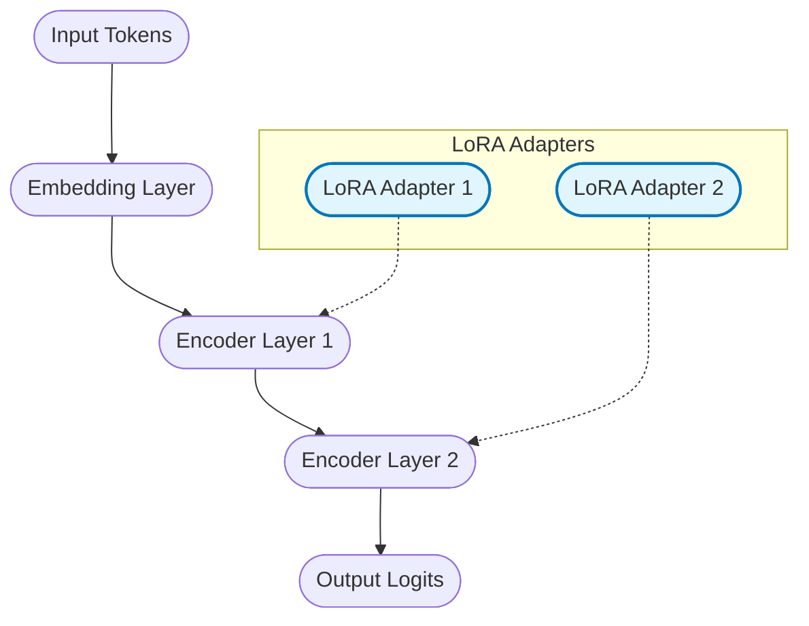

# Langtune: Efficient LoRA Fine-Tuning for Text LLMs (Latest)

<div align="center">

<picture>
  <source media="(prefers-color-scheme: dark)" srcset="static/langtune-use-dark.png">
  
</picture>

### Fine-tune your first LLM in under 5 minutes

[](https://pypi.org/project/langtune/)
[](https://pepy.tech/project/langtune)
[](LICENSE)
[]()

</div>

---

## What You'll Need

```bash
# Quick system check
python --version 

# Check GPU support (Optional but recommended)
python -c "import torch; print('GPU ready!' if torch.cuda.is_available() else 'CPU mode - still works!')"
```

## Install LangTrain

```bash
# Step 1: Create a clean environment (recommended)
python -m venv langtrain-env
source langtrain-env/bin/activate  # Windows: langtrain-env\Scripts\activate

# Step 2: Install LangTune
pip install langtune

# Step 3: Verify it worked
python -c "import langtune; print('✅ LangTune installed!')"
```

## Train Your First Model

```python
from langtune import LoRATrainer

# Step 1: Define your training data
training_data = [
    {"user": "Hello!", "assistant": "Hi there! How can I help you today?"},
    {"user": "What can you do?", "assistant": "I can answer questions, have conversations, and help with various tasks!"},
    {"user": "Thanks!", "assistant": "You're welcome! Feel free to ask anything else."}
]

# Step 2: Create the trainer
# This sets up everything for you automatically
trainer = LoRATrainer(
    model_name="microsoft/DialoGPT-medium",
    output_dir="./my_first_chatbot",
)

# Step 3: Train!
trainer.train(training_data)

# Step 4: Test your model
response = trainer.chat("Hello!")
print(f"Your AI says: {response}")
```

## Use Your Trained Model

```python
from langtune import ChatModel

# Load your trained model
model = ChatModel.load("./my_first_chatbot")

# Have a conversation
print(model.chat("Hello!"))
print(model.chat("What can you do?"))
```

## Using Your Own Data

```python
from langtune import LoRATrainer

trainer = LoRATrainer(
    model_name="microsoft/DialoGPT-medium",
    output_dir="./custom_chatbot",
)

# Method 1: Load from a JSONL file
# File should contain: {"user": "...", "assistant": "..."}
trainer.train_from_file("my_conversations.jsonl")

# Method 2: Load from Hugging Face datasets
trainer.train_from_hub("your_username/your_dataset")
```

## Next Steps

1.  **Train a larger model**: Use `QLoRATrainer` for 4-bit quantization (runs Llama-3-8B on 6GB VRAM!).
2.  **Deploy as API**: Use `langtune.deploy("./my_model", port=8000)`.
3.  **Read the Docs**: Check out [langtrain.xyz/docs](https://langtrain.xyz/docs).

---

## Architecture Overview

Langtune uses a modular transformer backbone with LoRA adapters injected into attention and MLP layers.



## Contributing

Contributions are welcome! See [CONTRIBUTING.md](CONTRIBUTING.md).

## License

MIT License. See [LICENSE](LICENSE).

## Citation

```bibtex
@software{langtune2025,
  author = {Pritesh Raj},
  title = {langtune: LLMs with Efficient LoRA Fine-Tuning},
  url = {https://github.com/langtrain-ai/langtune},
  year = {2025}
}
```
